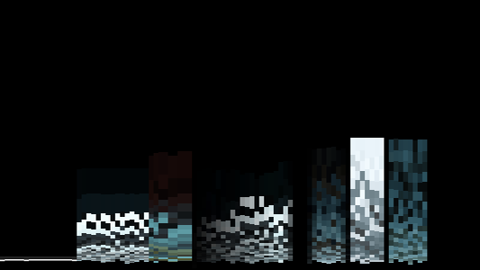
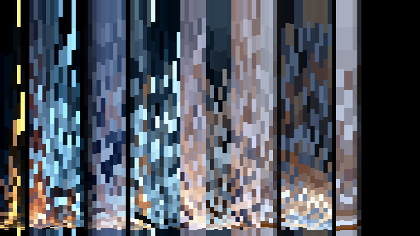
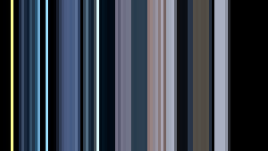

# 영상 색상 타임라인 시각화(Color Timeline Visualization for Video)

## 프로젝트 소개

이 프로젝트는 **영상의 전체 색상 분위기와 변화를 한눈에 볼 수 있도록** 주요 색상 정보를 시간 순서대로 시각화하는 Python 기반 도구입니다. 영상의 각 구간이 어떤 색상으로 이루어져 있는지, 색상 분위기가 어떻게 변하는지 직관적으로 파악할 수 있습니다.

---

## 활용 예시 및 결과 비교

아래 표는 두 개의 생성형 AI 영상을 분석한 결과를 보여줍니다. 각 열이 영상(유튜브 썸네일), 20색 타임라인, 1색 타임라인이 아니라, **각 열이 영상1, 영상2**가 되고, **각 행이 비교 항목**이 되도록 구성했습니다.

|        | 영상1 | 영상2 |
|:------:|:-----:|:-----:|
| **영상** | [](https://youtu.be/bXEXqcsBPYU?feature=shared) | [](timeline_1color_h) |
| **20색<br>타임라인** |  |  |
| **1색<br>타임라인** |  |  |

- **유튜브 썸네일**: 클릭 시 해당 영상으로 이동합니다.
- **20색 타임라인**: 각 프레임의 상위 20개 색상을 비율에 따라 세로 막대(리트머스 바)로 표현, 시간 순서대로 이어붙인 결과
- **1색 타임라인**: 각 프레임의 가장 대표적인 색상만 추출해 이어붙인 결과

---

## 주요 기능

- **영상에서 균등 간격으로 프레임 추출**
- **각 프레임의 주요 색상(상위 20개) 추출 및 비율 계산**
- **색상 비율을 리트머스 막대(세로 바)로 시각화**
- **모든 프레임의 막대 이미지를 이어붙여 하나의 타임라인 이미지로 생성**
- **결과 이미지를 16:9 비율로 저장**

---

## 사용 방법

1. **환경 준비**
   ```bash
   python -m venv .venv
   .venv\Scripts\activate  # (Windows)
   pip install -r requirements.txt
   ```

2. **분석할 영상 준비**
   - `sample/sample.mp4` 위치에 분석할 영상을 넣으세요.
   - (예시: 생성형 AI로 만든 영상)

3. **실행**
   ```bash
   python mv_color_timeline.py
   ```

4. **결과 확인**
   - `timeline_20colors.png`, `timeline_1color.png` 파일이 생성됩니다.
   - (예시 이미지는 위 표 참고)

---

## 코드 구조

- `mv_color_timeline.py` : 전체 파이프라인 구현
  - 프레임 추출 → 색상 추출 → 막대그래프 생성 → 이어붙이기 → 16:9 비율 저장
- `sample/` : 분석할 영상 파일 위치
- `frames/` : 추출된 프레임 이미지 저장 폴더(자동 생성)
- `bars/` : 각 프레임별 막대그래프 이미지 저장 폴더(자동 생성)