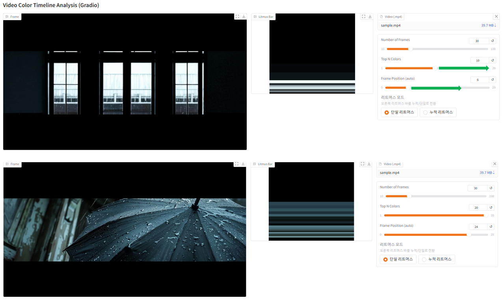
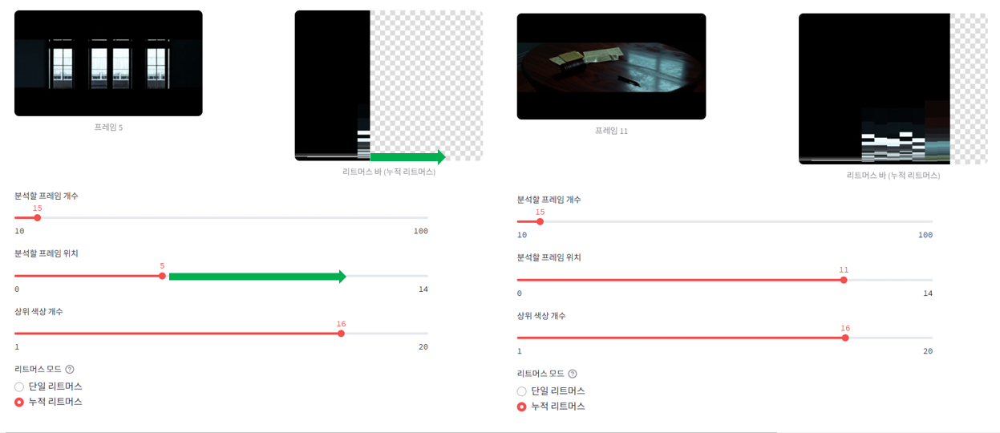
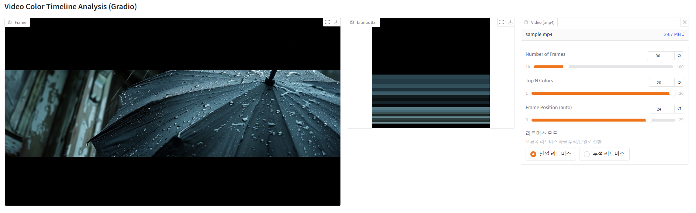

# video2litmus

## Project Overview

**Cross-platform video color timeline visualizer**: A Python-based tool to extract and visualize the overall mood of a music video (or any video) as a single color timeline image. Supports both **Gradio** and **Streamlit** UIs via MVVM adapter pattern.

## Key Features

1. Dual UI & Platform Support
   - Streamlit & Gradio UI support (adapter pattern, MVVM)
   - Cross-platform: Selectable UI via main.py launcher

2. Video Processing & Color Extraction
   - Frame extraction and caching at regular intervals
   - KMeans-based extraction and ratio calculation of top N colors per frame

3. Visualization & Interaction
   - Litmus bar (vertical color bar) visualization for each frame
   - Toggle between single/accumulated litmus bar modes
   - Sliders for frame count, frame position, and number of colors

## Gradio vs Streamlit: Framework Comparison

| Feature/Platform         | Gradio                                   | Streamlit                        |
|-------------------------|------------------------------------------|----------------------------------|
| **Real-time reactive (onchange)** | **Supported**                        |                                  |
| Typical use             | ML demo, interactive data app            | Data dashboard, analytics app     |
| Python support          | Yes                                      | Yes                              |

## Gradio UI Example



## Streamlit UI Example



## UI Change Example (Slider/Mode)



---

## How to Use

1. **Setup Environment**
   ```bash
   python -m venv .venv
   .venv\Scripts\activate  # (Windows)
   pip install -r requirements.txt
   ```

2. **Prepare Video**
   - Upload your video file via the UI (recommended)
   - (Direct file placement is not required; use the upload feature in the UI)

3. **Run**
   - Recommended: `python main.py` and select UI in browser (choose Gradio or Streamlit)
   - (Direct execution of view_gradio.py or view_streamlit.py is possible for development, but use main.py for normal use)

4. **Check Results**
   - Use the UI to view frame images, litmus bars, adjust sliders, and toggle modes

## Code Structure

- `view_gradio.py` : Gradio UI view
- `view_streamlit.py` : Streamlit UI view
- `viewmodel.py` : Analysis logic, connects View and Model
- `model.py` : Core functions for color extraction, litmus bar generation, frame extraction, etc.
- `main.py` : Flask-based UI launcher (choose Gradio/Streamlit in browser)
- `.st_tmp_frames/` : Temporary storage for frame/litmus bar images