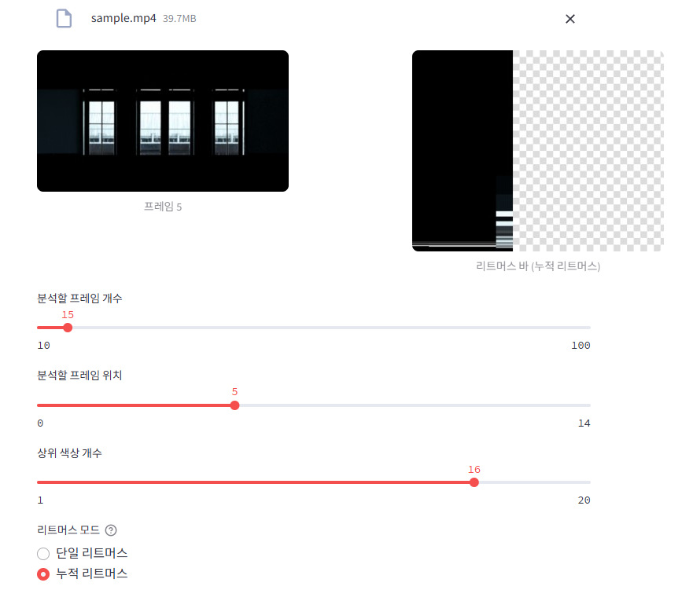

# video2litmus

## Project Overview

**Cross-platform video color timeline visualizer**: A Python-based tool to extract and visualize the overall mood of a music video (or any video) as a single color timeline image. Supports both **Gradio** and **Streamlit** UIs via MVVM adapter pattern.

## Key Features

- **Dual UI support: Streamlit & Gradio (adapter pattern)**
- **Frame extraction and caching at regular intervals**
- **KMeans-based extraction and ratio calculation of top N colors per frame**
- **Litmus bar (vertical color bar) visualization for each frame**
- **Toggle between single/accumulated litmus bar modes**
- **Sliders for frame count, frame position, and number of colors**
- **Cross-platform: Gradio and Streamlit UI selectable (adapter pattern)**
- **Platform launcher (main.py) to select UI via web**

## Gradio vs Streamlit: Framework Comparison

| Gradio | Streamlit |
|--------|-----------|
| Web-based ML/data app framework | Web-based data app/dashboard framework |
| Fast ML demo, interactive UI | Fast data visualization, interactive app |
| 3-column horizontal layout, image download/zoom | 2-column + bottom controls, vertical layout |
| Real-time reactive (onchange), various widgets | Real-time reactive (onchange), various widgets |
| Image/file upload & download | Image/file upload |
| Deploy: HuggingFace Spaces, etc. | Deploy: Streamlit Cloud, etc. |
| Python only, simple code | Python only, simple code |
---

## Gradio UI Example


## Streamlit UI Example


## UI Change Example (Slider/Mode)

 

---

## How to Use

1. **Setup Environment**
   ```bash
   python -m venv .venv
   .venv\Scripts\activate  # (Windows)
   pip install -r requirements.txt
   ```

2. **Prepare Video**
   - Upload your video file via the UI (recommended)
   - (Direct file placement is not required; use the upload feature in the UI)

3. **Run**
   - Recommended: `python main.py` and select UI in browser (choose Gradio or Streamlit)
   - (Direct execution of view_gradio.py or view_streamlit.py is possible for development, but use main.py for normal use)

4. **Check Results**
   - Use the UI to view frame images, litmus bars, adjust sliders, and toggle modes

## Code Structure

- `view_gradio.py` : Gradio UI view
- `view_streamlit.py` : Streamlit UI view
- `viewmodel.py` : Analysis logic, connects View and Model
- `model.py` : Core functions for color extraction, litmus bar generation, frame extraction, etc.
- `main.py` : Flask-based UI launcher (choose Gradio/Streamlit in browser)
- `.st_tmp_frames/` : Temporary storage for frame/litmus bar images