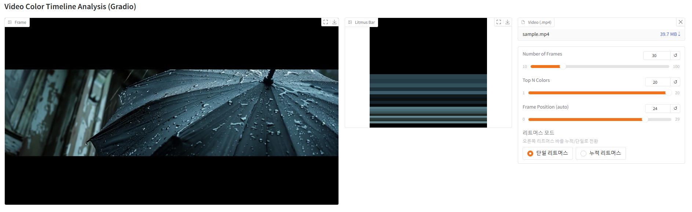

# video2litmus

## 프로젝트 개요

**크로스플랫폼 영상 색상 타임라인 시각화 도구**: Python 기반으로, 뮤직비디오(또는 일반 영상)의 전체 분위기를 한 장의 색상 타임라인 이미지로 추출·시각화할 수 있습니다. MVVM 어댑터 패턴을 통해 **Gradio**와 **Streamlit** UI를 모두 지원합니다.

## 주요 기능

1. UI/플랫폼 지원
   - Streamlit & Gradio UI 동시 지원 (adapter 패턴, MVVM)
   - main.py 런처를 통한 UI 선택 및 실행 (크로스플랫폼)

2. 영상 처리 및 색상 추출
   - 프레임을 균등 간격으로 추출하고 캐싱
   - 각 프레임별 상위 N개 색상(KMeans) 및 비율 계산

3. 시각화 및 인터랙션
   - 프레임별 리트머스 바(세로 색상 바) 시각화
   - 단일/누적 리트머스 바 모드 토글
   - 프레임 개수, 위치, 색상 개수 슬라이더 제공

## Gradio vs Streamlit: 프레임워크 비교

| 기능/플랫폼                  | Gradio                                   | Streamlit                        |
|-------------------------|------------------------------------------|----------------------------------|
| **실시간 반응형(onchange)** | **지원**                                 |                                  |
| 대표 용도                  | ML 데모, 인터랙티브 데이터 앱            | 데이터 대시보드, 분석 앱         |
| Python 지원               | 예                                       | 예                               |

## Gradio UI 예시


## Streamlit UI 예시


## UI 변화 예시 (슬라이더/모드)



---

## 사용 방법

1. **환경 준비**
   ```bash
   python -m venv .venv
   .venv\Scripts\activate  # (Windows)
   pip install -r requirements.txt
   ```

2. **분석할 영상 준비**
   - UI에서 영상 파일을 업로드하세요. (권장)
   - (직접 파일을 둘 필요 없이, UI 업로드 기능을 사용하세요)

3. **실행**
   - 권장: `python main.py` 실행 후 웹에서 UI(Gradio/Streamlit) 선택
   - (view_gradio.py, view_streamlit.py 직접 실행은 개발용이며, 일반 사용자는 main.py를 이용하세요)

4. **결과 확인**
   - UI에서 프레임 이미지, 리트머스 바, 슬라이더, 모드 토글 등 기능을 직접 확인하세요.

## 코드 구조

- `view_gradio.py` : Gradio UI 뷰
- `view_streamlit.py` : Streamlit UI 뷰
- `viewmodel.py` : 분석 로직, View와 Model 연결
- `model.py` : 색상 추출, 리트머스 바 생성, 프레임 추출 등 핵심 함수
- `main.py` : Flask 기반 UI 런처(웹에서 Gradio/Streamlit 선택)
- `.st_tmp_frames/` : 임시 프레임/리트머스 바 이미지 저장 폴더

---